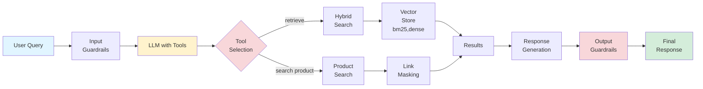

# Curator Pommeline Chatbot

An intelligent, LLM-powered chatbot built with FastAPI, featuring hybrid semantic search, comprehensive guardrails, and modular tool orchestration for retail shopping assistance.

## Features

| Feature                   | Description                                                                        |
| ------------------------- | ---------------------------------------------------------------------------------- |
| Intelligent Tool Planning | Automatically determines when to search products vs. retrieve knowledge            |
| Hybrid Search             | Combines BM25 keyword search with semantic embeddings using Reciprocal Rank Fusion |
| Guardrail Protection      | Blocks prompt injection, inappropriate content, and out-of-scope queries           |
| Link Masking              | Prevents hallucinated URLs with masked link tokens                                 |
| Performance Tracking      | Comprehensive latency monitoring and metrics                                       |
| Citation System           | Provides sources for all factual claims                                            |
| Modular Architecture      | Easy to extend and customize components                                            |

## System Architecture



## Installation

### Prerequisites

- Python 3.10+
- UV package manager
- Docker (for Pinecone index container)

### Setup

1. **Clone the repository**

```bash
git clone https://github.com/aamir-nus/curator-pommeline/
```

2. **Install dependencies**

```bash
uv install #project is setup using uv, not pip
```

3. **Configure environment variables**

```bash
cp .env.example .env
# Edit .env with your API keys
```

4. **Set up vector store**

```bash
# Pull and run Pinecone index container
docker pull ghcr.io/pinecone-io/pinecone-index:latest

docker run -d \
  --name pommeline-dense-index \
  -e PORT=5081 \
  -e INDEX_TYPE=serverless \
  -e VECTOR_TYPE=dense \
  -e DIMENSION=768 \
  -e METRIC=dotproduct \
  -p 5081:5081 \
  --platform linux/amd64 \
  ghcr.io/pinecone-io/pinecone-index:latest
```

5. **Run the server**

```bash
python scripts/run_server.py
```

The API will be available at `http://localhost:8000`

## API Usage

### Ingest Documents

```bash
# Ingest markdown documents
curl -X POST "http://localhost:8000/ingest/documents" \
  -H "Content-Type: application/json" \
  -d '{
    "file_paths": ["./data/products/iphone_16_pro.md"],
    "chunk_size": 300,
    "chunk_overlap": 50
  }'
```

### Retrieve Information

#### Hybrid Search (Recommended)

```bash
curl -X POST "http://localhost:8000/inference/chat" \
  -H "Content-Type: application/json" \
  -d '{
    "query": "iPhone 16 Pro features",
    "search_mode": "hybrid"
  }'
```

#### Semantic Search

```bash
curl -X POST "http://localhost:8000/inference/chat" \
  -H "Content-Type: application/json" \
  -d '{
    "query": "laptops for creative work",
    "search_mode": "semantic"
  }'
```

#### Keyword Search

```bash
curl -X POST "http://localhost:8000/inference/chat" \
  -H "Content-Type: application/json" \
  -d '{
    "query": "student discount eligibility",
    "search_mode": "keyword"
  }'
```

### Chat

```bash
curl -X POST "http://localhost:8000/inference/chat" \
  -H "Content-Type: application/json" \
  -d '{
    "query": "What phones do you have under $800?",
    "search_mode": "hybrid",
    "user_context": {
      "name": "Alex",
      "age_group": "25-35",
      "region": "US"
    }
  }'
```

## Performance Metrics

### Latency Performance (October 2025)

| Query Type     | Tool Calls Used       | TTFT (ms) | Total Time (s) | Status        |
| -------------- | --------------------- | --------- | -------------- | ------------- |
| Product Search | search_products       | 1,165     | 11.75          | Fast          |
| Feature Query  | retrieve_knowledge    | 1,201     | 14.96          | Good          |
| Brand Search   | search_products (×3) | 1,907     | 27.69          | Acceptable    |
| Context Query  | None                  | 14,383    | 15.54          | Needs Context |

| Component                | Expected Latency | Actual Latency | Status      |
| ------------------------ | ---------------- | -------------- | ----------- |
| Guardrail Classification | 10-50ms          | 0.5ms          | Faster      |
| Product Search           | 50-200ms         | 0.27ms         | Faster      |
| Document Ingestion       | 2000-10000ms     | 9413ms         | As Expected |
| TTFT (Streaming)         | 1300-1800ms      | 1,165-1,900ms  | As Expected |

## Configuration

### Environment Variables

| Variable             | Description               | Default                    |
| -------------------- | ------------------------- | -------------------------- |
| DEFAULT_LLM_MODEL    | LLM model to use          | glm-4.5-air                |
| PINECONE_API_KEY     | Pinecone API key          | local-dev-key              |
| PINECONE_HOST        | Pinecone host URL         | http://localhost:5081      |
| PINECONE_INDEX_NAME  | Index name                | curator-pommeline          |
| EMBEDDING_MODEL      | Embedding model           | google/embeddinggemma-300m |
| MAX_RETRIEVED_DOCS   | Max documents to retrieve | 10                         |
| SIMILARITY_THRESHOLD | Search threshold          | 0.15                       |
| SEARCH_MODE          | Default search mode       | hybrid                     |

### Supported Models

**LLM Models:**

- openrouter/glm-4.5-air (default)
- openrouter/glm-4-32b (GLM)

**Embedding Model:**

- google/embeddinggemma-300m (default)

## API Documentation

Once the server is running, visit:

- **Swagger UI**: `http://localhost:8000/docs`
- **ReDoc**: `http://localhost:8000/redoc`

### Key Endpoints

| Endpoint            | Method | Description           |
| ------------------- | ------ | --------------------- |
| /inference/chat     | POST   | Main chat endpoint    |
| /ingest/documents   | POST   | Ingest documents      |
| /guardrail/classify | POST   | Classify text content |
| /health             | GET    | Health check          |
| /stats              | GET    | System statistics     |

## Testing

### Pre-Build Verification

Before running the full project, verify Pinecone setup:

```bash
# 1. Check Docker container
docker ps | grep pommeline-dense-index

# 2. Test vector store functionality
source .venv/bin/activate && python3 -c "
import sys; sys.path.insert(0, 'src')
from ingestion.vector_store import get_vector_store
vs = get_vector_store()
stats = vs.get_stats()
print(f'Vector store initialized: {stats}')
"

# 3. Test embedding model
source .venv/bin/activate && python3 -c "
import sys; sys.path.insert(0, 'src')
from ingestion.embedder import get_embedder
e = get_embedder(); e.load_model()
emb = e.generate_single_embedding('test')
print(f'Embeddings working: shape={emb.shape}')
"
```

### Run Test Suite

```bash
# Run all tests
uv run pytest

# Run specific test file
uv run pytest tests/test_chunker.py

# Run Pinecone integration tests
uv run pytest tests/test_pinecone_integration.py -v

# Run with coverage
uv run pytest --cov=src
```

### Demo Notebooks

For interactive examples and detailed walkthroughs, see the following notebooks:

#### Document Ingestion Demo

```bash
jupyter notebook notebooks/01_document_ingestion_demo_unified.ipynb
```

#### Chat with Tools Session

```bash
jupyter notebook notebooks/03_chat_with_tools_session.ipynb
```

#### End-to-End Demo

```bash
jupyter notebook notebooks/04_end_to_end_demo.ipynb
```

## Quick Start

1. **Start services**

```bash
# Start Pinecone container
docker run -d \
  --name pommeline-dense-index \
  -e PORT=5081 \
  -e INDEX_TYPE=serverless \
  -e VECTOR_TYPE=dense \
  -e DIMENSION=768 \
  -e METRIC=dotproduct \
  -p 5081:5081 \
  --platform linux/amd64 \
  ghcr.io/pinecone-io/pinecone-index:latest

# Start the API server
python scripts/run_server.py
```

2. **Ingest sample data**

```bash
curl -X POST "http://localhost:8000/ingest/documents" \
  -H "Content-Type: application/json" \
  -d '{
    "file_paths": ["./data/products/*"],
    "chunk_size": 300,
    "chunk_overlap": 50
  }'
```

3. **Test the system**

```bash
curl -X POST "http://localhost:8000/inference/chat" \
  -H "Content-Type: application/json" \
  -d '{
    "query": "What iPhones do you have available?",
    "search_mode": "hybrid"
  }'
```

## Guardrails

The system includes comprehensive safety mechanisms:

### Prompt Injection Detection

- Blocks attempts to override system instructions
- Detects role-playing and manipulation attempts
- Confidence-based blocking with configurable thresholds

### Content Filtering

- Inappropriate content detection using rule-based classifiers
- Out-of-scope query identification
- Context-aware classification with confidence scoring

### Link Safety

- URL masking to prevent hallucinated links
- Token-based link replacement system
- Automatic unmasking in responses

### Performance Impact

| Guardrail Component        | Latency | Effectiveness |
| -------------------------- | ------- | ------------- |
| Prompt Injection Detection | 0.5ms   | High          |
| Content Filtering          | 1-2ms   | High          |
| Link Masking               | <1ms    | Complete      |

## License

This project is licensed under the MIT License.

## Working with the Code

For detailed information about how the project works, code examples, and development workflows, see [WORKING.md](WORKING.md).
